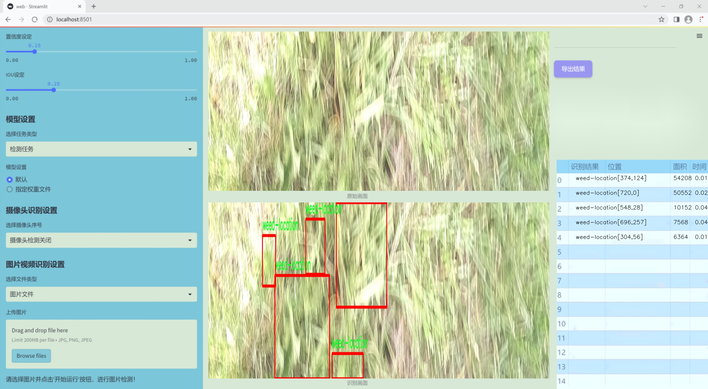
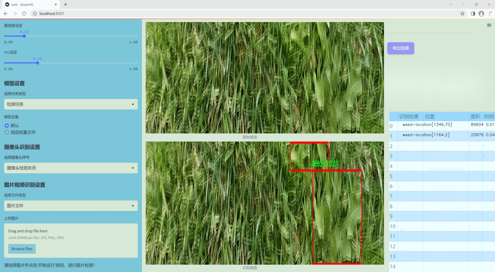
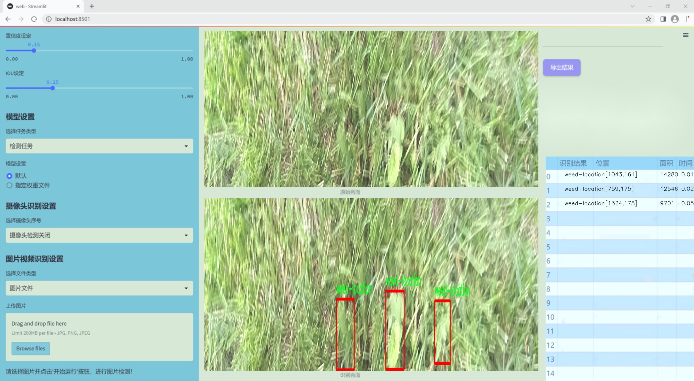
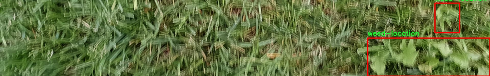
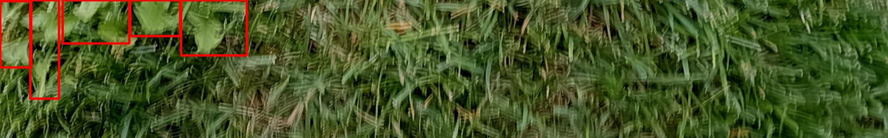
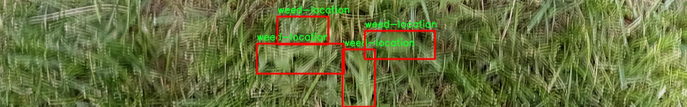
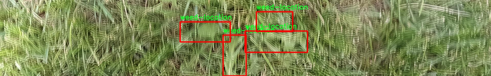
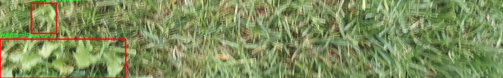

# 改进yolo11-DBBNCSPELAN等200+全套创新点大全：杂草检测系统源码＆数据集全套

### 1.图片效果展示







##### 项目来源 **[人工智能促进会 2024.10.30](https://kdocs.cn/l/cszuIiCKVNis)**

注意：由于项目一直在更新迭代，上面“1.图片效果展示”和“2.视频效果展示”展示的系统图片或者视频可能为老版本，新版本在老版本的基础上升级如下：（实际效果以升级的新版本为准）

  （1）适配了YOLOV11的“目标检测”模型和“实例分割”模型，通过加载相应的权重（.pt）文件即可自适应加载模型。

  （2）支持“图片识别”、“视频识别”、“摄像头实时识别”三种识别模式。

  （3）支持“图片识别”、“视频识别”、“摄像头实时识别”三种识别结果保存导出，解决手动导出（容易卡顿出现爆内存）存在的问题，识别完自动保存结果并导出到tempDir中。

  （4）支持Web前端系统中的标题、背景图等自定义修改。

  另外本项目提供训练的数据集和训练教程,暂不提供权重文件（best.pt）,需要您按照教程进行训练后实现图片演示和Web前端界面演示的效果。

### 2.视频效果展示

[2.1 视频效果展示](https://www.bilibili.com/video/BV1pPSqYzEFc/)

### 3.背景

研究背景与意义

随着全球农业生产的不断发展，杂草的管理与控制已成为提高作物产量和质量的重要环节。杂草不仅会与作物争夺水分、养分和光照，还可能成为病虫害的滋生地，从而对农业生产造成严重影响。因此，及时、准确地识别和处理杂草是现代农业管理中不可或缺的一部分。传统的杂草检测方法多依赖人工识别，效率低下且容易受到主观因素的影响。近年来，随着计算机视觉和深度学习技术的快速发展，基于图像识别的杂草检测系统逐渐成为研究热点。

本研究旨在基于改进的YOLOv11模型，构建一个高效的杂草检测系统。YOLO（You Only Look Once）系列模型以其实时性和高准确率在目标检测领域取得了显著成果。YOLOv11作为最新版本，结合了多种先进的网络结构和优化算法，具有更强的特征提取能力和更快的推理速度。然而，现有的YOLOv11模型在特定的农业应用场景中仍存在一定的局限性，尤其是在杂草种类多样、环境复杂的情况下。因此，针对这一问题，本研究将对YOLOv11进行改进，以提高其在杂草检测中的性能。

本研究所使用的数据集“full_width_weeds”包含120幅图像，尽管样本数量相对较少，但其在目标检测中的应用潜力不容忽视。通过对该数据集的深入分析与处理，结合改进后的YOLOv11模型，期望能够实现对不同类型杂草的准确识别与分类，从而为农业生产提供有效的技术支持。这不仅有助于提升杂草管理的效率，还将推动智能农业的发展，为实现可持续农业生产提供新的解决方案。

### 4.数据集信息展示

##### 4.1 本项目数据集详细数据（类别数＆类别名）

nc: 1
names: ['weed-location']


该项目为【目标检测】数据集，请在【训练教程和Web端加载模型教程（第三步）】这一步的时候按照【目标检测】部分的教程来训练

##### 4.2 本项目数据集信息介绍

本项目数据集信息介绍

本项目所使用的数据集名为“full_width_weeds”，旨在为改进YOLOv11的杂草检测系统提供高质量的训练数据。该数据集专注于单一类别的杂草定位，包含了丰富的样本，以支持深度学习模型在复杂环境中的表现。数据集中类别数量为1，具体类别为“weed-location”，这一类别涵盖了多种不同类型的杂草在不同生长阶段和环境条件下的表现，确保模型能够有效识别和定位杂草。

“full_width_weeds”数据集的构建过程经过精心设计，涵盖了多样化的场景，包括城市绿地、农田、草坪等多种环境，以提高模型的泛化能力。数据集中每个样本均经过标注，确保在训练过程中，模型能够准确学习到杂草的特征。这些样本不仅包括杂草的整体图像，还包括特定区域的放大图，以便于模型在细节识别上进行更深入的学习。

此外，数据集的采集过程遵循严格的标准，确保了数据的多样性和代表性。样本的拍摄时间、光照条件、天气变化等因素均被考虑在内，以模拟实际应用中的各种挑战。这种全面的设计理念旨在提升YOLOv11在杂草检测任务中的准确性和鲁棒性。

通过使用“full_width_weeds”数据集，我们期望在杂草检测领域取得显著的进展，推动智能农业和环境监测技术的发展，为实现精准农业提供有力支持。











### 5.全套项目环境部署视频教程（零基础手把手教学）

[5.1 所需软件PyCharm和Anaconda安装教程（第一步）](https://www.bilibili.com/video/BV1BoC1YCEKi/?spm_id_from=333.999.0.0&vd_source=bc9aec86d164b67a7004b996143742dc)


[5.2 安装Python虚拟环境创建和依赖库安装视频教程（第二步）](https://www.bilibili.com/video/BV1ZoC1YCEBw?spm_id_from=333.788.videopod.sections&vd_source=bc9aec86d164b67a7004b996143742dc)

### 6.改进YOLOv11训练教程和Web_UI前端加载模型教程（零基础手把手教学）

[6.1 改进YOLOv11训练教程和Web_UI前端加载模型教程（第三步）](https://www.bilibili.com/video/BV1BoC1YCEhR?spm_id_from=333.788.videopod.sections&vd_source=bc9aec86d164b67a7004b996143742dc)


按照上面的训练视频教程链接加载项目提供的数据集，运行train.py即可开始训练



     Epoch   gpu_mem       box       obj       cls    labels  img_size
     1/200     20.8G   0.01576   0.01955  0.007536        22      1280: 100%|██████████| 849/849 [14:42<00:00,  1.04s/it]
               Class     Images     Labels          P          R     mAP@.5 mAP@.5:.95: 100%|██████████| 213/213 [01:14<00:00,  2.87it/s]
                 all       3395      17314      0.994      0.957      0.0957      0.0843

     Epoch   gpu_mem       box       obj       cls    labels  img_size
     2/200     20.8G   0.01578   0.01923  0.007006        22      1280: 100%|██████████| 849/849 [14:44<00:00,  1.04s/it]
               Class     Images     Labels          P          R     mAP@.5 mAP@.5:.95: 100%|██████████| 213/213 [01:12<00:00,  2.95it/s]
                 all       3395      17314      0.996      0.956      0.0957      0.0845

     Epoch   gpu_mem       box       obj       cls    labels  img_size
     3/200     20.8G   0.01561    0.0191  0.006895        27      1280: 100%|██████████| 849/849 [10:56<00:00,  1.29it/s]
               Class     Images     Labels          P          R     mAP@.5 mAP@.5:.95: 100%|███████   | 187/213 [00:52<00:00,  4.04it/s]
                 all       3395      17314      0.996      0.957      0.0957      0.0845


###### [项目数据集下载链接](https://kdocs.cn/l/cszuIiCKVNis)

### 7.原始YOLOv11算法讲解

YOLOv11是Ultralytics推出的YOLO系列最新版本，专为实现尖端的物体检测而设计。其架构和训练方法上进行了重大改进，使之不仅具备卓越的准确性和处理速度，还在计算效率上实现了一场革命。得益于其改进的主干和颈部架构，YOLOv11在特征提取和处理复杂任务时表现更加出色。在2024年9月27日，Ultralytics通过长达九小时的在线直播发布这一新作，展示了其在计算机视觉领域的革新。

YOLOv11通过精细的架构设计和优化训练流程，在保持高精度的同时，缩减了参数量，与YOLOv8m相比减少了22%的参数，使其在COCO数据集上的平均准确度（mAP）有所提升。这种效率的提高使YOLOv11非常适合部署在各种硬件环境中，包括边缘设备、云计算平台以及支持NVIDIA GPU的系统，确保在灵活性上的优势。

该模型支持广泛的任务，从对象检测、实例分割到图像分类、姿态估计和定向对象检测（OBB），几乎覆盖了计算机视觉的所有主要挑战。其创新的C3k2和C2PSA模块提升了网络深度和注意力机制的应用，提高了特征提取的效率和效果。同时，YOLOv11的改进网络结构也使之在复杂视觉任务上得以从容应对，成为各类计算机视觉任务的多功能选择。这些特性令YOLOv11在实施实时物体检测的各个领域中表现出众。
* * *

2024年9月27日，Ultralytics在线直播长达九小时，为YOLO11召开“发布会”

YOLO11 是 Ultralytics YOLO 系列实时物体检测器的最新版本，它以尖端的准确性、速度和效率重新定义了可能性。在之前 YOLO
版本的显著进步的基础上，YOLO11 在架构和训练方法方面进行了重大改进，使其成为各种计算机视觉任务的多功能选择。


##### YOLO11主要特点：

  * 增强的特征提取：YOLO11 采用了改进的主干和颈部架构，增强了特征提取能力，可实现更精确的对象检测和复杂任务性能。
  * 针对效率和速度进行了优化：YOLO11 引入了完善的架构设计和优化的训练流程，可提供更快的处理速度，并在准确度和性能之间保持最佳平衡。
  * 更少的参数，更高的准确度：借助模型设计的进步，YOLO11m 在 COCO 数据集上实现了更高的平均准确度 (mAP)，同时使用的参数比 YOLOv8m 少 22%，从而提高了计算效率，同时又不影响准确度。
  * 跨环境的适应性：YOLO11 可以无缝部署在各种环境中，包括边缘设备、云平台和支持 NVIDIA GPU 的系统，从而确保最大的灵活性。
  * 支持的任务范围广泛：无论是对象检测、实例分割、图像分类、姿势估计还是定向对象检测 (OBB)，YOLO11 都旨在满足各种计算机视觉挑战。

##### 支持的任务和模式

YOLO11 以 YOLOv8 中引入的多功能模型系列为基础，为各种计算机视觉任务提供增强的支持：

Model| Filenames| Task| Inference| Validation| Training| Export  
---|---|---|---|---|---|---  
YOLO11| yolol11n.pt, yolol11s.pt, yolol11m.pt, yolol11x.pt| Detection| ✅| ✅|
✅| ✅  
YOLO11-seg| yolol11n-seg.pt, yolol11s-seg.pt, yolol11m-seg.pt,
yolol11x-seg.pt| Instance Segmentation| ✅| ✅| ✅| ✅  
YOLO11-pose| yolol11n-pose.pt, yolol11s-pose.pt, yolol11m-pose.pt,
yolol11x-pose.pt| Pose/Keypoints| ✅| ✅| ✅| ✅  
YOLO11-obb| yolol11n-obb.pt, yolol11s-obb.pt, yolol11m-obb.pt,
yolol11x-obb.pt| Oriented Detection| ✅| ✅| ✅| ✅  
YOLO11-cls| yolol11n-cls.pt, yolol11s-cls.pt, yolol11m-cls.pt,
yolol11x-cls.pt| Classification| ✅| ✅| ✅| ✅  
  
##### 简单的 YOLO11 训练和推理示例

以下示例适用于用于对象检测的 YOLO11 Detect 模型。

    
    
    from ultralytics import YOLO
    
    # Load a model
    model = YOLO("yolo11n.pt")
    
    # Train the model
    train_results = model.train(
        data="coco8.yaml",  # path to dataset YAML
        epochs=100,  # number of training epochs
        imgsz=640,  # training image size
        device="cpu",  # device to run on, i.e. device=0 or device=0,1,2,3 or device=cpu
    )
    
    # Evaluate model performance on the validation set
    metrics = model.val()
    
    # Perform object detection on an image
    results = model("path/to/image.jpg")
    results[0].show()
    
    # Export the model to ONNX format
    path = model.export(format="onnx")  # return path to exported model

##### 支持部署于边缘设备

YOLO11 专为适应各种环境而设计，包括边缘设备。其优化的架构和高效的处理能力使其适合部署在边缘设备、云平台和支持 NVIDIA GPU
的系统上。这种灵活性确保 YOLO11 可用于各种应用，从移动设备上的实时检测到云环境中的复杂分割任务。有关部署选项的更多详细信息，请参阅导出文档。

##### YOLOv11 yaml文件

    
    
    # Ultralytics YOLO 🚀, AGPL-3.0 license
    # YOLO11 object detection model with P3-P5 outputs. For Usage examples see https://docs.ultralytics.com/tasks/detect
    
    # Parameters
    nc: 80 # number of classes
    scales: # model compound scaling constants, i.e. 'model=yolo11n.yaml' will call yolo11.yaml with scale 'n'
      # [depth, width, max_channels]
      n: [0.50, 0.25, 1024] # summary: 319 layers, 2624080 parameters, 2624064 gradients, 6.6 GFLOPs
      s: [0.50, 0.50, 1024] # summary: 319 layers, 9458752 parameters, 9458736 gradients, 21.7 GFLOPs
      m: [0.50, 1.00, 512] # summary: 409 layers, 20114688 parameters, 20114672 gradients, 68.5 GFLOPs
      l: [1.00, 1.00, 512] # summary: 631 layers, 25372160 parameters, 25372144 gradients, 87.6 GFLOPs
      x: [1.00, 1.50, 512] # summary: 631 layers, 56966176 parameters, 56966160 gradients, 196.0 GFLOPs
    
    # YOLO11n backbone
    backbone:
      # [from, repeats, module, args]
      - [-1, 1, Conv, [64, 3, 2]] # 0-P1/2
      - [-1, 1, Conv, [128, 3, 2]] # 1-P2/4
      - [-1, 2, C3k2, [256, False, 0.25]]
      - [-1, 1, Conv, [256, 3, 2]] # 3-P3/8
      - [-1, 2, C3k2, [512, False, 0.25]]
      - [-1, 1, Conv, [512, 3, 2]] # 5-P4/16
      - [-1, 2, C3k2, [512, True]]
      - [-1, 1, Conv, [1024, 3, 2]] # 7-P5/32
      - [-1, 2, C3k2, [1024, True]]
      - [-1, 1, SPPF, [1024, 5]] # 9
      - [-1, 2, C2PSA, [1024]] # 10
    
    # YOLO11n head
    head:
      - [-1, 1, nn.Upsample, [None, 2, "nearest"]]
      - [[-1, 6], 1, Concat, [1]] # cat backbone P4
      - [-1, 2, C3k2, [512, False]] # 13
    
      - [-1, 1, nn.Upsample, [None, 2, "nearest"]]
      - [[-1, 4], 1, Concat, [1]] # cat backbone P3
      - [-1, 2, C3k2, [256, False]] # 16 (P3/8-small)
    
      - [-1, 1, Conv, [256, 3, 2]]
      - [[-1, 13], 1, Concat, [1]] # cat head P4
      - [-1, 2, C3k2, [512, False]] # 19 (P4/16-medium)
    
      - [-1, 1, Conv, [512, 3, 2]]
      - [[-1, 10], 1, Concat, [1]] # cat head P5
      - [-1, 2, C3k2, [1024, True]] # 22 (P5/32-large)
    
      - [[16, 19, 22], 1, Detect, [nc]] # Detect(P3, P4, P5)
    

**YOLO11和YOLOv8 yaml文件的区别**


##### 改进模块代码

  * C3k2 

    
    
    class C3k2(C2f):
        """Faster Implementation of CSP Bottleneck with 2 convolutions."""
    
        def __init__(self, c1, c2, n=1, c3k=False, e=0.5, g=1, shortcut=True):
            """Initializes the C3k2 module, a faster CSP Bottleneck with 2 convolutions and optional C3k blocks."""
            super().__init__(c1, c2, n, shortcut, g, e)
            self.m = nn.ModuleList(
                C3k(self.c, self.c, 2, shortcut, g) if c3k else Bottleneck(self.c, self.c, shortcut, g) for _ in range(n)
            )

C3k2，它是具有两个卷积的CSP（Partial Cross Stage）瓶颈架构的更快实现。

**类继承：**

  * `C3k2`继承自类`C2f`。这表明`C2f`很可能实现了经过修改的基本CSP结构，而`C3k2`进一步优化或修改了此结构。

**构造函数（`__init__`）：**

  * `c1`：输入通道。

  * `c2`：输出通道。

  * `n`：瓶颈层数（默认为1）。

  * `c3k`：一个布尔标志，确定是否使用`C3k`块或常规`Bottleneck`块。

  * `e`：扩展比率，控制隐藏层的宽度（默认为0.5）。

  * `g`：分组卷积的组归一化参数或组数（默认值为 1）。

  * `shortcut`：一个布尔值，用于确定是否在网络中包含快捷方式连接（默认值为 `True`）。

**初始化：**

  * `super().__init__(c1, c2, n, short-cut, g, e)` 调用父类 `C2f` 的构造函数，初始化标准 CSP 组件，如通道数、快捷方式、组等。

**模块列表（`self.m`）：**

  * `nn.ModuleList` 存储 `C3k` 或 `Bottleneck` 模块，具体取决于 `c3k` 的值。

  * 如果 `c3k` 为 `True`，它会初始化 `C3k` 模块。`C3k` 模块接收以下参数：

  * `self.c`：通道数（源自 `C2f`）。

  * `2`：这表示在 `C3k` 块内使用了两个卷积层。

  * `shortcut` 和 `g`：从 `C3k2` 构造函数传递。

  * 如果 `c3k` 为 `False`，则初始化标准 `Bottleneck` 模块。

`for _ in range(n)` 表示将创建 `n` 个这样的块。

**总结：**

  * `C3k2` 实现了 CSP 瓶颈架构，可以选择使用自定义 `C3k` 块（具有两个卷积）或标准 `Bottleneck` 块，具体取决于 `c3k` 标志。

  * C2PSA

    
    
    class C2PSA(nn.Module):
        """
        C2PSA module with attention mechanism for enhanced feature extraction and processing.
    
        This module implements a convolutional block with attention mechanisms to enhance feature extraction and processing
        capabilities. It includes a series of PSABlock modules for self-attention and feed-forward operations.
    
        Attributes:
            c (int): Number of hidden channels.
            cv1 (Conv): 1x1 convolution layer to reduce the number of input channels to 2*c.
            cv2 (Conv): 1x1 convolution layer to reduce the number of output channels to c.
            m (nn.Sequential): Sequential container of PSABlock modules for attention and feed-forward operations.
    
        Methods:
            forward: Performs a forward pass through the C2PSA module, applying attention and feed-forward operations.
    
        Notes:
            This module essentially is the same as PSA module, but refactored to allow stacking more PSABlock modules.
    
        Examples:
            >>> c2psa = C2PSA(c1=256, c2=256, n=3, e=0.5)
            >>> input_tensor = torch.randn(1, 256, 64, 64)
            >>> output_tensor = c2psa(input_tensor)
        """
    
        def __init__(self, c1, c2, n=1, e=0.5):
            """Initializes the C2PSA module with specified input/output channels, number of layers, and expansion ratio."""
            super().__init__()
            assert c1 == c2
            self.c = int(c1 * e)
            self.cv1 = Conv(c1, 2 * self.c, 1, 1)
            self.cv2 = Conv(2 * self.c, c1, 1)
    
            self.m = nn.Sequential(*(PSABlock(self.c, attn_ratio=0.5, num_heads=self.c // 64) for _ in range(n)))
    
        def forward(self, x):
            """Processes the input tensor 'x' through a series of PSA blocks and returns the transformed tensor."""
            a, b = self.cv1(x).split((self.c, self.c), dim=1)
            b = self.m(b)
            return self.cv2(torch.cat((a, b), 1))

`C2PSA` 模块是一个自定义神经网络层，带有注意力机制，用于增强特征提取和处理。

**类概述**

  * **目的：**

  * `C2PSA` 模块引入了一个卷积块，利用注意力机制来改进特征提取和处理。

  * 它使用一系列 `PSABlock` 模块，这些模块可能代表某种形式的位置自注意力 (PSA)，并且该架构旨在允许堆叠多个 `PSABlock` 层。

**构造函数（`__init__`）：**

  * **参数：**

  * `c1`：输入通道（必须等于 `c2`）。

  * `c2`：输出通道（必须等于 `c1`）。

  * `n`：要堆叠的 `PSABlock` 模块数量（默认值为 1）。

  * `e`：扩展比率，用于计算隐藏通道的数量（默认值为 0.5）。

  * **属性：**

  * `self.c`：隐藏通道数，计算为 `int(c1 * e)`。

  * `self.cv1`：一个 `1x1` 卷积，将输入通道数从 `c1` 减少到 `2 * self.c`。这为将输入分成两部分做好准备。

  * `self.cv2`：另一个 `1x1` 卷积，处理后将通道维度恢复回 `c1`。

  * `self.m`：一系列 `PSABlock` 模块。每个 `PSABlock` 接收 `self.c` 通道，注意头的数量为 `self.c // 64`。每个块应用注意和前馈操作。

**前向方法：**

  * **输入：**

  * `x`，输入张量。

  * **操作：**

  1. `self.cv1(x)` 应用 `1x1` 卷积，将输入通道大小从 `c1` 减小到 `2 * self.c`。

  2. 生成的张量沿通道维度分为两部分，`a` 和 `b`。

  * `a`：第一个 `self.c` 通道。

  * `b`：剩余的 `self.c` 通道。

  1. `b` 通过顺序容器 `self.m`，它是 `PSABlock` 模块的堆栈。这部分经过基于注意的处理。

  2. 处理后的张量 `b` 与 `a` 连接。

  3. `self.cv2` 应用 `1x1` 卷积，将通道大小恢复为 `c1`。

  * **输出：**

  * 应用注意和卷积操作后的变换后的张量。

**总结：**

  * **C2PSA** 是一个增强型卷积模块，它通过堆叠的 `PSABlock` 模块应用位置自注意力。它拆分输入张量，将注意力应用于其中一部分，然后重新组合并通过最终卷积对其进行处理。此结构有助于从输入数据中提取复杂特征。

##### 网络结构


### 8.200+种全套改进YOLOV11创新点原理讲解

#### 8.1 200+种全套改进YOLOV11创新点原理讲解大全

由于篇幅限制，每个创新点的具体原理讲解就不全部展开，具体见下列网址中的改进模块对应项目的技术原理博客网址【Blog】（创新点均为模块化搭建，原理适配YOLOv5~YOLOv11等各种版本）

[改进模块技术原理博客【Blog】网址链接](https://gitee.com/qunmasj/good)


#### 8.2 精选部分改进YOLOV11创新点原理讲解

###### 这里节选部分改进创新点展开原理讲解(完整的改进原理见上图和[改进模块技术原理博客链接](https://gitee.com/qunmasj/good)【如果此小节的图加载失败可以通过CSDN或者Github搜索该博客的标题访问原始博客，原始博客图片显示正常】

### RCS-OSA的基本原理
参考该博客，RCSOSA（RCS-One-Shot Aggregation）是RCS-YOLO中提出的一种结构，我们可以将主要原理概括如下：

1. RCS（Reparameterized Convolution based on channel Shuffle）: 结合了通道混洗，通过重参数化卷积来增强网络的特征提取能力。

2. RCS模块: 在训练阶段，利用多分支结构学习丰富的特征表示；在推理阶段，通过结构化重参数化简化为单一分支，减少内存消耗。

3. OSA（One-Shot Aggregation）: 一次性聚合多个特征级联，减少网络计算负担，提高计算效率。

4. 特征级联: RCS-OSA模块通过堆叠RCS，确保特征的复用并加强不同层之间的信息流动。

#### RCS
RCS（基于通道Shuffle的重参数化卷积）是RCS-YOLO的核心组成部分，旨在训练阶段通过多分支结构学习丰富的特征信息，并在推理阶段通过简化为单分支结构来减少内存消耗，实现快速推理。此外，RCS利用通道分割和通道Shuffle操作来降低计算复杂性，同时保持通道间的信息交换，这样在推理阶段相比普通的3×3卷积可以减少一半的计算复杂度。通过结构重参数化，RCS能够在训练阶段从输入特征中学习深层表示，并在推理阶段实现快速推理，同时减少内存消耗。

#### RCS模块
RCS（基于通道Shuffle的重参数化卷积）模块中，结构在训练阶段使用多个分支，包括1x1和3x3的卷积，以及一个直接的连接（Identity），用于学习丰富的特征表示。在推理阶段，结构被重参数化成一个单一的3x3卷积，以减少计算复杂性和内存消耗，同时保持训练阶段学到的特征表达能力。这与RCS的设计理念紧密相连，即在不牺牲性能的情况下提高计算效率。


上图为大家展示了RCS的结构，分为训练阶段（a部分）和推理阶段（b部分）。在训练阶段，输入通过通道分割，一部分输入经过RepVGG块，另一部分保持不变。然后通过1x1卷积和3x3卷积处理RepVGG块的输出，与另一部分输入进行通道Shuffle和连接。在推理阶段，原来的多分支结构被简化为一个单一的3x3 RepConv块。这种设计允许在训练时学习复杂特征，在推理时减少计算复杂度。黑色边框的矩形代表特定的模块操作，渐变色的矩形代表张量的特定特征，矩形的宽度代表张量的通道数。 

#### OSA
OSA（One-Shot Aggregation）是一个关键的模块，旨在提高网络在处理密集连接时的效率。OSA模块通过表示具有多个感受野的多样化特征，并在最后的特征映射中仅聚合一次所有特征，从而克服了DenseNet中密集连接的低效率问题。

OSA模块的使用有两个主要目的：

1. 提高特征表示的多样性：OSA通过聚合具有不同感受野的特征来增加网络对于不同尺度的敏感性，这有助于提升模型对不同大小目标的检测能力。

2. 提高效率：通过在网络的最后一部分只进行一次特征聚合，OSA减少了重复的特征计算和存储需求，从而提高了网络的计算和能源效率。

在RCS-YOLO中，OSA模块被进一步与RCS（基于通道Shuffle的重参数化卷积）相结合，形成RCS-OSA模块。这种结合不仅保持了低成本的内存消耗，而且还实现了语义信息的有效提取，对于构建轻量级和大规模的对象检测器尤为重要。

下面我将为大家展示RCS-OSA（One-Shot Aggregation of RCS）的结构。


在RCS-OSA模块中，输入被分为两部分，一部分直接通过，另一部分通过堆叠的RCS模块进行处理。处理后的特征和直接通过的特征在通道混洗（Channel Shuffle）后合并。这种结构设计用于增强模型的特征提取和利用效率，是RCS-YOLO架构中的一个关键组成部分旨在通过一次性聚合来提高模型处理特征的能力，同时保持计算效率。

#### 特征级联
特征级联（feature cascade）是一种技术，通过在网络的一次性聚合（one-shot aggregate）路径上维持有限数量的特征级联来实现的。在RCS-YOLO中，特别是在RCS-OSA（RCS-Based One-Shot Aggregation）模块中，只保留了三个特征级联。

特征级联的目的是为了减轻网络计算负担并降低内存占用。这种方法可以有效地聚合不同层次的特征，提高模型的语义信息提取能力，同时避免了过度复杂化网络结构所带来的低效率和高资源消耗。

下面为大家提供的图像展示的是RCS-YOLO的整体架构，其中包括RCS-OSA模块。RCS-OSA在模型中用于堆叠RCS模块，以确保特征的复用并加强不同层之间的信息流动。图中显示的多层RCS-OSA模块的排列和组合反映了它们如何一起工作以优化特征传递和提高检测性能。


总结：RCS-YOLO主要由RCS-OSA（蓝色模块）和RepVGG（橙色模块）构成。这里的n代表堆叠RCS模块的数量。n_cls代表检测到的对象中的类别数量。图中的IDetect是从YOLOv11中借鉴过来的，表示使用二维卷积神经网络的检测层。这个架构通过堆叠的RCS模块和RepVGG模块，以及两种类型的检测层，实现了对象检测的任务。 


### 9.系统功能展示

图9.1.系统支持检测结果表格显示

  图9.2.系统支持置信度和IOU阈值手动调节

  图9.3.系统支持自定义加载权重文件best.pt(需要你通过步骤5中训练获得)

  图9.4.系统支持摄像头实时识别

  图9.5.系统支持图片识别

  图9.6.系统支持视频识别

  图9.7.系统支持识别结果文件自动保存

  图9.8.系统支持Excel导出检测结果数据


### 10. YOLOv11核心改进源码讲解

#### 10.1 lsknet.py

以下是对代码中最核心部分的提取和详细注释：

```python
import torch
import torch.nn as nn
from torch.nn.modules.utils import _pair as to_2tuple
from functools import partial

class Mlp(nn.Module):
    """多层感知机（MLP）模块"""
    def __init__(self, in_features, hidden_features=None, out_features=None, act_layer=nn.GELU, drop=0.):
        super().__init__()
        out_features = out_features or in_features  # 输出特征数默认为输入特征数
        hidden_features = hidden_features or in_features  # 隐藏层特征数默认为输入特征数
        self.fc1 = nn.Conv2d(in_features, hidden_features, 1)  # 1x1卷积
        self.dwconv = DWConv(hidden_features)  # 深度卷积
        self.act = act_layer()  # 激活函数
        self.fc2 = nn.Conv2d(hidden_features, out_features, 1)  # 1x1卷积
        self.drop = nn.Dropout(drop)  # Dropout层

    def forward(self, x):
        """前向传播"""
        x = self.fc1(x)  # 通过第一个卷积层
        x = self.dwconv(x)  # 通过深度卷积
        x = self.act(x)  # 激活
        x = self.drop(x)  # Dropout
        x = self.fc2(x)  # 通过第二个卷积层
        x = self.drop(x)  # Dropout
        return x


class Attention(nn.Module):
    """注意力模块"""
    def __init__(self, d_model):
        super().__init__()
        self.proj_1 = nn.Conv2d(d_model, d_model, 1)  # 1x1卷积
        self.activation = nn.GELU()  # 激活函数
        self.spatial_gating_unit = LSKblock(d_model)  # 空间门控单元
        self.proj_2 = nn.Conv2d(d_model, d_model, 1)  # 1x1卷积

    def forward(self, x):
        """前向传播"""
        shortcut = x.clone()  # 残差连接
        x = self.proj_1(x)  # 通过第一个卷积层
        x = self.activation(x)  # 激活
        x = self.spatial_gating_unit(x)  # 通过空间门控单元
        x = self.proj_2(x)  # 通过第二个卷积层
        x = x + shortcut  # 残差连接
        return x


class Block(nn.Module):
    """网络中的基本块"""
    def __init__(self, dim, mlp_ratio=4., drop=0., drop_path=0., act_layer=nn.GELU):
        super().__init__()
        self.norm1 = nn.BatchNorm2d(dim)  # 批归一化
        self.norm2 = nn.BatchNorm2d(dim)  # 批归一化
        self.attn = Attention(dim)  # 注意力模块
        self.drop_path = DropPath(drop_path) if drop_path > 0. else nn.Identity()  # 随机深度
        mlp_hidden_dim = int(dim * mlp_ratio)  # MLP隐藏层维度
        self.mlp = Mlp(in_features=dim, hidden_features=mlp_hidden_dim, act_layer=act_layer, drop=drop)  # MLP模块

    def forward(self, x):
        """前向传播"""
        x = x + self.drop_path(self.attn(self.norm1(x)))  # 添加注意力模块的输出
        x = x + self.drop_path(self.mlp(self.norm2(x)))  # 添加MLP模块的输出
        return x


class LSKNet(nn.Module):
    """LSKNet模型"""
    def __init__(self, img_size=224, in_chans=3, embed_dims=[64, 128, 256, 512], depths=[3, 4, 6, 3]):
        super().__init__()
        self.num_stages = len(embed_dims)  # 网络阶段数

        for i in range(self.num_stages):
            # 创建图像到补丁的嵌入层
            patch_embed = OverlapPatchEmbed(img_size=img_size if i == 0 else img_size // (2 ** (i + 1)),
                                            in_chans=in_chans if i == 0 else embed_dims[i - 1],
                                            embed_dim=embed_dims[i])
            # 创建基本块
            block = nn.ModuleList([Block(dim=embed_dims[i]) for _ in range(depths[i])])
            setattr(self, f"patch_embed{i + 1}", patch_embed)  # 将嵌入层添加到模型中
            setattr(self, f"block{i + 1}", block)  # 将块添加到模型中

    def forward(self, x):
        """前向传播"""
        outs = []
        for i in range(self.num_stages):
            patch_embed = getattr(self, f"patch_embed{i + 1}")
            block = getattr(self, f"block{i + 1}")
            x, H, W = patch_embed(x)  # 通过嵌入层
            for blk in block:
                x = blk(x)  # 通过每个块
            outs.append(x)  # 保存输出
        return outs


class DWConv(nn.Module):
    """深度卷积模块"""
    def __init__(self, dim=768):
        super(DWConv, self).__init__()
        self.dwconv = nn.Conv2d(dim, dim, 3, 1, 1, bias=True, groups=dim)  # 深度卷积

    def forward(self, x):
        """前向传播"""
        x = self.dwconv(x)  # 通过深度卷积
        return x


def lsknet_t(weights=''):
    """创建LSKNet T版本的模型"""
    model = LSKNet(embed_dims=[32, 64, 160, 256], depths=[3, 3, 5, 2])
    if weights:
        model.load_state_dict(torch.load(weights)['state_dict'])  # 加载权重
    return model

if __name__ == '__main__':
    model = lsknet_t('lsk_t_backbone-2ef8a593.pth')  # 创建模型并加载权重
    inputs = torch.randn((1, 3, 640, 640))  # 创建输入
    for i in model(inputs):
        print(i.size())  # 打印输出尺寸
```

### 代码核心部分说明：
1. **Mlp类**：实现了一个多层感知机，包含两个1x1卷积层和一个深度卷积层，支持激活函数和Dropout。
2. **Attention类**：实现了一个注意力机制，使用了残差连接和空间门控单元。
3. **Block类**：是网络的基本构建块，包含注意力模块和MLP模块，并实现了残差连接。
4. **LSKNet类**：构建了整个网络结构，包含多个阶段，每个阶段由嵌入层和多个Block组成。
5. **DWConv类**：实现了深度卷积操作。
6. **lsknet_t函数**：用于创建LSKNet T版本的模型并加载预训练权重。

以上是对代码的核心部分进行了提取和详细注释，涵盖了主要的网络结构和功能。

这个文件 `lsknet.py` 实现了一个名为 LSKNet 的深度学习模型，主要用于图像处理任务。该模型的结构包括多个模块，结合了卷积神经网络（CNN）和注意力机制。以下是对文件中各个部分的逐步分析和说明。

首先，文件导入了必要的库，包括 PyTorch 和一些相关的模块。`torch` 是深度学习的核心库，`torch.nn` 提供了构建神经网络的基础组件。`timm.layers` 中的 `DropPath` 和 `to_2tuple` 用于实现特定的层和功能。

接下来，定义了一个名为 `Mlp` 的类，这是一个多层感知机（MLP）模块。它包含两个卷积层和一个深度卷积层（`DWConv`），并使用 GELU 激活函数和 Dropout 进行正则化。该模块的前向传播方法依次通过卷积、激活、Dropout 等操作处理输入数据。

然后是 `LSKblock` 类，这是模型的核心块之一。它使用深度卷积和空间卷积来提取特征，并通过两个不同的卷积路径生成注意力权重。最终，利用 Sigmoid 函数对特征进行加权，输出加权后的特征图。

接着是 `Attention` 类，它实现了一个注意力机制。通过两个卷积层和一个 `LSKblock`，该模块对输入进行处理，并将处理后的结果与输入的快捷连接相加，以增强特征表达能力。

`Block` 类是模型的基本构建块，结合了归一化、注意力机制和 MLP。它通过残差连接和 DropPath 技术来提高模型的稳定性和性能。

`OverlapPatchEmbed` 类用于将输入图像转换为补丁嵌入，采用卷积操作来实现。这一过程将图像划分为多个小块，并为每个小块生成特征表示。

`LSKNet` 类是整个模型的主类，负责构建网络的不同阶段。它根据给定的参数初始化多个嵌入层、块和归一化层，并在前向传播中依次处理输入数据。每个阶段的输出被收集到一个列表中，最终返回。

`DWConv` 类实现了深度卷积操作，进一步增强了特征提取能力。

`update_weight` 函数用于更新模型的权重，确保加载的权重与模型的结构相匹配。

最后，`lsknet_t` 和 `lsknet_s` 函数分别用于创建不同版本的 LSKNet 模型，并可选择性地加载预训练权重。主程序部分创建了一个 LSKNet 模型实例，并对随机生成的输入进行前向传播，输出每个阶段的特征图尺寸。

整体来看，这个文件实现了一个结构复杂、功能强大的图像处理模型，结合了多种深度学习技术，适用于各种计算机视觉任务。

#### 10.2 CTrans.py

以下是经过简化和注释的核心代码部分，主要包括 `ChannelTransformer`、`Encoder`、`Block_ViT`、`Attention_org` 和 `Channel_Embeddings` 类。注释详细解释了每个部分的功能和实现逻辑。

```python
import torch
import torch.nn as nn
import numpy as np
from torch.nn import Dropout, Softmax, LayerNorm

class Channel_Embeddings(nn.Module):
    """构建通道嵌入，包括位置嵌入和补丁嵌入。"""
    def __init__(self, patchsize, img_size, in_channels):
        super().__init__()
        # 计算补丁数量
        n_patches = (img_size[0] // patchsize) * (img_size[1] // patchsize)
        # 定义补丁嵌入层
        self.patch_embeddings = nn.Sequential(
            nn.MaxPool2d(kernel_size=5, stride=5),
            nn.Conv2d(in_channels=in_channels, out_channels=in_channels, kernel_size=patchsize // 5, stride=patchsize // 5)
        )
        # 定义位置嵌入
        self.position_embeddings = nn.Parameter(torch.zeros(1, n_patches, in_channels))
        self.dropout = Dropout(0.1)

    def forward(self, x):
        """前向传播，计算嵌入。"""
        if x is None:
            return None
        x = self.patch_embeddings(x)  # 计算补丁嵌入
        x = x.flatten(2).transpose(-1, -2)  # 变形为 (B, n_patches, hidden)
        embeddings = x + self.position_embeddings  # 加上位置嵌入
        return self.dropout(embeddings)  # 返回经过dropout的嵌入

class Attention_org(nn.Module):
    """实现多头注意力机制。"""
    def __init__(self, vis, channel_num):
        super(Attention_org, self).__init__()
        self.vis = vis
        self.KV_size = sum(channel_num)  # 计算键值对的大小
        self.num_attention_heads = 4  # 注意力头的数量

        # 定义查询、键、值的线性变换
        self.query_layers = nn.ModuleList([nn.Linear(c, c, bias=False) for c in channel_num])
        self.key = nn.Linear(self.KV_size, self.KV_size, bias=False)
        self.value = nn.Linear(self.KV_size, self.KV_size, bias=False)
        self.softmax = Softmax(dim=3)
        self.attn_dropout = Dropout(0.1)

    def forward(self, *embeddings):
        """前向传播，计算注意力输出。"""
        multi_head_Q = [query(emb) for query, emb in zip(self.query_layers, embeddings) if emb is not None]
        multi_head_K = self.key(torch.cat(embeddings, dim=2))  # 计算键
        multi_head_V = self.value(torch.cat(embeddings, dim=2))  # 计算值

        # 计算注意力分数
        attention_scores = [torch.matmul(Q, multi_head_K) / np.sqrt(self.KV_size) for Q in multi_head_Q]
        attention_probs = [self.softmax(score) for score in attention_scores]  # 计算注意力概率

        # 应用dropout并计算上下文层
        context_layers = [torch.matmul(prob, multi_head_V) for prob in attention_probs]
        return context_layers  # 返回上下文层

class Block_ViT(nn.Module):
    """实现一个Transformer块，包括注意力和前馈网络。"""
    def __init__(self, vis, channel_num):
        super(Block_ViT, self).__init__()
        self.attn_norms = nn.ModuleList([LayerNorm(c, eps=1e-6) for c in channel_num])  # 归一化层
        self.channel_attn = Attention_org(vis, channel_num)  # 注意力机制
        self.ffns = nn.ModuleList([Mlp(c, c * 4) for c in channel_num])  # 前馈网络

    def forward(self, *embeddings):
        """前向传播，计算输出。"""
        # 计算注意力输出
        attn_outputs = self.channel_attn(*[norm(emb) for norm, emb in zip(self.attn_norms, embeddings)])
        # 计算前馈网络输出
        outputs = [emb + attn for emb, attn in zip(embeddings, attn_outputs)]
        return outputs  # 返回每个通道的输出

class Encoder(nn.Module):
    """编码器，包含多个Transformer块。"""
    def __init__(self, vis, channel_num):
        super(Encoder, self).__init__()
        self.layers = nn.ModuleList([Block_ViT(vis, channel_num) for _ in range(1)])  # 多个Transformer块

    def forward(self, *embeddings):
        """前向传播，依次通过每个块。"""
        for layer in self.layers:
            embeddings = layer(*embeddings)  # 通过每个块
        return embeddings  # 返回最终输出

class ChannelTransformer(nn.Module):
    """通道变换器，整合嵌入、编码和重构。"""
    def __init__(self, channel_num=[64, 128, 256, 512], img_size=640, vis=False, patchSize=[40, 20, 10, 5]):
        super().__init__()
        # 初始化嵌入层
        self.embeddings = nn.ModuleList([Channel_Embeddings(patch, img_size // (2 ** i), c) for i, (patch, c) in enumerate(zip(patchSize, channel_num))])
        self.encoder = Encoder(vis, channel_num)  # 编码器
        self.reconstruct = nn.ModuleList([Reconstruct(c, c, kernel_size=1, scale_factor=(patch, patch)) for patch, c in zip(patchSize, channel_num)])  # 重构层

    def forward(self, en):
        """前向传播，处理输入并返回输出。"""
        embeddings = [embed(en[i]) for i, embed in enumerate(self.embeddings) if en[i] is not None]
        encoded = self.encoder(*embeddings)  # 编码
        reconstructed = [recon(enc) + en[i] for i, (recon, enc) in enumerate(zip(self.reconstruct, encoded)) if en[i] is not None]  # 重构
        return reconstructed  # 返回重构后的输出
```

以上代码展示了一个通道变换器的基本结构，包含了嵌入、注意力机制、编码器和重构层的实现。每个类和方法都配有详细的中文注释，帮助理解其功能和实现逻辑。

这个程序文件 `CTrans.py` 实现了一个基于通道的变换器（Channel Transformer），用于处理图像数据。程序主要由多个类组成，每个类负责不同的功能，整体结构体现了深度学习模型的模块化设计。

首先，程序引入了一些必要的库，包括 PyTorch 和 NumPy，这些库为深度学习模型的构建和数学运算提供了支持。接着，定义了几个类，每个类都有其特定的功能。

`Channel_Embeddings` 类用于构建图像的嵌入表示。它通过最大池化和卷积操作将输入图像划分为多个小块（patch），并为每个小块生成位置嵌入。该类的 `forward` 方法负责将输入数据进行处理，生成最终的嵌入表示。

`Reconstruct` 类则用于重建图像。它通过卷积和上采样操作，将经过编码的特征图转换回原始图像的空间分辨率。该类的 `forward` 方法负责将输入的嵌入数据转换为图像特征。

`Attention_org` 类实现了多头注意力机制。它接收多个嵌入并计算注意力权重，利用这些权重对输入进行加权求和，从而提取出重要的特征信息。这个类的 `forward` 方法负责计算查询、键、值的线性变换，并进行注意力分数的计算和归一化。

`Mlp` 类实现了一个简单的多层感知机（MLP），用于特征的非线性变换。它包含两个全连接层和一个激活函数，能够对输入特征进行处理。

`Block_ViT` 类结合了注意力机制和前馈网络，形成了一个完整的变换器块。它在 `forward` 方法中首先对输入进行归一化，然后通过注意力层和前馈网络进行处理，最后将结果与输入进行残差连接。

`Encoder` 类由多个 `Block_ViT` 组成，负责将输入的嵌入通过多个变换器块进行编码。它的 `forward` 方法依次调用每个块，并返回经过编码的特征。

`ChannelTransformer` 类是整个模型的核心，负责将输入图像划分为多个通道并进行处理。它初始化了多个嵌入层、编码器和重建层，并在 `forward` 方法中依次处理输入数据，最终返回重建后的图像。

最后，`GetIndexOutput` 类用于从模型的输出中提取特定索引的结果，便于后续处理。

整体来看，这个程序实现了一个复杂的图像处理模型，利用了变换器的结构来提取和重建图像特征，适用于各种计算机视觉任务。每个模块的设计都体现了深度学习模型的灵活性和可扩展性，使得该模型能够根据需要进行调整和优化。

#### 10.3 SMPConv.py

以下是代码中最核心的部分，并附上详细的中文注释：

```python
import torch
import torch.nn as nn
import torch.nn.functional as F

# 定义相对位置的函数
def rel_pos(kernel_size):
    # 创建一个从-1到1的线性空间，大小为kernel_size
    tensors = [torch.linspace(-1, 1, steps=kernel_size) for _ in range(2)]
    # 生成网格坐标
    kernel_coord = torch.stack(torch.meshgrid(*tensors), dim=-0)
    kernel_coord = kernel_coord.unsqueeze(0)  # 增加一个维度
    return kernel_coord

# 定义SMP卷积层
class SMPConv(nn.Module):
    def __init__(self, planes, kernel_size, n_points, stride, padding, groups):
        super().__init__()

        self.planes = planes  # 输出通道数
        self.kernel_size = kernel_size  # 卷积核大小
        self.n_points = n_points  # 点的数量
        self.init_radius = 2 * (2/kernel_size)  # 初始化半径

        # 计算卷积核坐标
        kernel_coord = rel_pos(kernel_size)
        self.register_buffer('kernel_coord', kernel_coord)  # 注册为缓冲区

        # 权重坐标初始化
        weight_coord = torch.empty(1, n_points, 2)
        nn.init.trunc_normal_(weight_coord, std=0.2, a=-1., b=1.)  # 使用截断正态分布初始化
        self.weight_coord = nn.Parameter(weight_coord)  # 注册为可学习参数

        # 半径参数初始化
        self.radius = nn.Parameter(torch.empty(1, n_points).unsqueeze(-1).unsqueeze(-1))
        self.radius.data.fill_(value=self.init_radius)  # 填充初始半径

        # 权重初始化
        weights = torch.empty(1, planes, n_points)
        nn.init.trunc_normal_(weights, std=.02)  # 使用截断正态分布初始化
        self.weights = nn.Parameter(weights)  # 注册为可学习参数

    def forward(self, x):
        # 生成卷积核
        kernels = self.make_kernels().unsqueeze(1)
        x = x.contiguous()  # 确保输入张量是连续的
        kernels = kernels.contiguous()  # 确保卷积核张量是连续的

        # 根据输入数据类型选择不同的卷积实现
        if x.dtype == torch.float32:
            x = _DepthWiseConv2dImplicitGEMMFP32.apply(x, kernels)  # FP32的深度卷积
        elif x.dtype == torch.float16:
            x = _DepthWiseConv2dImplicitGEMMFP16.apply(x, kernels)  # FP16的深度卷积
        else:
            raise TypeError("Only support fp32 and fp16, get {}".format(x.dtype))  # 抛出不支持的类型错误
        return x        

    def make_kernels(self):
        # 计算卷积核的差异
        diff = self.weight_coord.unsqueeze(-2) - self.kernel_coord.reshape(1, 2, -1).transpose(1, 2)  # [1, n_points, kernel_size^2, 2]
        diff = diff.transpose(2, 3).reshape(1, self.n_points, 2, self.kernel_size, self.kernel_size)  # 重塑形状
        diff = F.relu(1 - torch.sum(torch.abs(diff), dim=2) / self.radius)  # 计算ReLU激活的差异
        
        # 计算最终的卷积核
        kernels = torch.matmul(self.weights, diff.reshape(1, self.n_points, -1))  # [1, planes, kernel_size*kernel_size]
        kernels = kernels.reshape(1, self.planes, *self.kernel_coord.shape[2:])  # [1, planes, kernel_size, kernel_size]
        kernels = kernels.squeeze(0)  # 去掉多余的维度
        kernels = torch.flip(kernels.permute(0, 2, 1), dims=(1,))  # 翻转卷积核
        return kernels

# 定义SMPCNN模块
class SMPCNN(nn.Module):
    def __init__(self, in_channels, out_channels, kernel_size, stride, groups, n_points=None, n_points_divide=4):
        super().__init__()
        self.kernel_size = kernel_size
        if n_points is None:
            n_points = int((kernel_size**2) // n_points_divide)  # 计算点的数量

        padding = kernel_size // 2  # 计算填充
        self.smp = conv_bn(in_channels=in_channels, out_channels=out_channels, kernel_size=kernel_size,
                           stride=stride, padding=padding, dilation=1, groups=groups, n_points=n_points)

        self.small_kernel = 5  # 小卷积核大小
        self.small_conv = Conv(in_channels, out_channels, self.small_kernel, stride, self.small_kernel // 2, groups, act=False)  # 小卷积层

    def forward(self, inputs):
        out = self.smp(inputs)  # 通过SMP卷积层
        out += self.small_conv(inputs)  # 加上小卷积层的输出
        return out
```

### 代码核心部分说明：
1. **SMPConv 类**：实现了一个自定义的卷积层，使用了相对位置编码和动态卷积核生成。
2. **make_kernels 方法**：计算卷积核的生成过程，使用权重和位置差异生成最终的卷积核。
3. **SMPCNN 类**：结合了自定义的SMP卷积层和一个小卷积层，形成一个复合卷积模块。

这个程序文件 `SMPConv.py` 实现了一种特殊的卷积神经网络模块，主要包含了 `SMPConv`、`SMPCNN`、`SMPCNN_ConvFFN` 和 `SMPBlock` 等类。文件中使用了 PyTorch 框架，结合了一些深度学习中的高级技术，如深度可分离卷积、正则化和残差连接等。

首先，`SMPConv` 类是核心的卷积模块，它在初始化时接受多个参数，包括输出通道数、卷积核大小、采样点数、步幅、填充和分组数。它使用 `rel_pos` 函数生成卷积核的相对位置，并通过注册缓冲区的方式保存这些位置。权重坐标和半径也在初始化时被定义并作为可训练参数。`forward` 方法中，输入张量通过 `make_kernels` 方法生成的卷积核进行卷积操作，支持 FP32 和 FP16 数据类型的输入。

`make_kernels` 方法负责计算卷积核的具体形状和权重。它通过计算权重坐标与卷积核坐标之间的差异，利用 ReLU 激活函数处理这些差异，并最终生成实际的卷积核。

`get_conv2d` 函数根据输入参数决定使用 `SMPConv` 还是标准的 `nn.Conv2d`，这使得代码在需要时能够灵活切换。

`SMPCNN` 类是一个组合模块，它将 `SMPConv` 和一个小卷积层结合在一起，形成一个更复杂的卷积结构。这个结构通过将输入分别传入两个卷积层并相加，增强了特征提取的能力。

`SMPCNN_ConvFFN` 类实现了一个前馈网络，包含两个逐点卷积层和一个 GELU 激活函数。它的设计使得可以在特征图上进行非线性变换，并通过残差连接将输入与输出相加，保持信息的流动。

`SMPBlock` 类则是一个更高层次的模块，结合了逐点卷积和大卷积核的结构。它通过残差连接和 DropPath 技术增强了网络的表达能力和稳定性。

此外，文件中还定义了一些辅助函数，如 `conv_bn` 和 `conv_bn_relu`，用于简化卷积层和批归一化层的组合创建过程。`fuse_bn` 函数则用于将卷积层和批归一化层融合，以提高推理速度。

总的来说，这个文件实现了一个灵活且高效的卷积神经网络模块，适用于各种计算机视觉任务，能够通过自定义的卷积操作和结构设计来提升模型的性能。

#### 10.4 test_selective_scan_easy.py

以下是经过简化和注释的核心代码部分：

```python
import torch
import torch.nn.functional as F

def selective_scan_easy(us, dts, As, Bs, Cs, Ds, delta_bias=None, delta_softplus=False, return_last_state=False, chunksize=64):
    """
    选择性扫描函数，执行一系列的状态更新和输出计算。
    
    参数：
    us: 输入张量，形状为 (B, G * D, L)
    dts: 时间增量张量，形状为 (B, G * D, L)
    As: 系数张量，形状为 (G * D, N)
    Bs: 系数张量，形状为 (B, G, N, L)
    Cs: 系数张量，形状为 (B, G, N, L)
    Ds: 偏置张量，形状为 (G * D)
    delta_bias: 可选的偏置调整，形状为 (G * D)
    delta_softplus: 是否应用softplus激活
    return_last_state: 是否返回最后的状态
    chunksize: 每次处理的时间步长

    返回：
    输出张量，形状为 (B, G * D, L)，或包含输出和最后状态的元组
    """
    
    def selective_scan_chunk(us, dts, As, Bs, Cs, hprefix):
        """
        处理一个时间块的选择性扫描。
        
        参数：
        us: 输入张量的一个块
        dts: 时间增量张量的一个块
        As, Bs, Cs: 系数张量
        hprefix: 前一个状态
        
        返回：
        输出张量和当前状态
        """
        ts = dts.cumsum(dim=0)  # 计算时间增量的累积和
        Ats = torch.einsum("gdn,lbgd->lbgdn", As, ts).exp()  # 计算指数
        rAts = Ats  # 归一化
        duts = dts * us  # 计算输入与时间增量的乘积
        dtBus = torch.einsum("lbgd,lbgn->lbgdn", duts, Bs)  # 计算中间结果
        hs_tmp = rAts * (dtBus / rAts).cumsum(dim=0)  # 更新状态
        hs = hs_tmp + Ats * hprefix.unsqueeze(0)  # 结合前一个状态
        ys = torch.einsum("lbgn,lbgdn->lbgd", Cs, hs)  # 计算输出
        return ys, hs

    # 数据类型和形状调整
    dtype = torch.float32
    dts = dts.to(dtype)
    if delta_bias is not None:
        dts += delta_bias.view(1, -1, 1).to(dtype)
    if delta_softplus:
        dts = F.softplus(dts)

    # 处理输入和系数张量的形状
    Bs = Bs.unsqueeze(1) if len(Bs.shape) == 3 else Bs
    Cs = Cs.unsqueeze(1) if len(Cs.shape) == 3 else Cs
    B, G, N, L = Bs.shape
    us = us.view(B, G, -1, L).permute(3, 0, 1, 2).to(dtype)
    dts = dts.view(B, G, -1, L).permute(3, 0, 1, 2).to(dtype)
    As = As.view(G, -1, N).to(dtype)
    Bs = Bs.permute(3, 0, 1, 2).to(dtype)
    Cs = Cs.permute(3, 0, 1, 2).to(dtype)

    oys = []  # 输出列表
    hprefix = us.new_zeros((B, G, -1, N), dtype=dtype)  # 初始化前一个状态
    for i in range(0, L, chunksize):
        ys, hs = selective_scan_chunk(
            us[i:i + chunksize], dts[i:i + chunksize], 
            As, Bs[i:i + chunksize], Cs[i:i + chunksize], hprefix
        )
        oys.append(ys)  # 收集输出
        hprefix = hs[-1]  # 更新前一个状态

    oys = torch.cat(oys, dim=0)  # 合并所有输出
    oys = oys.permute(1, 2, 3, 0).view(B, -1, L)  # 调整输出形状

    return oys if not return_last_state else (oys, hprefix.view(B, -1, N).float())  # 返回输出或输出和最后状态
```

### 代码说明：
1. **函数定义**：`selective_scan_easy` 是主要的选择性扫描函数，接受多个输入张量和参数，返回计算后的输出。
2. **内部函数**：`selective_scan_chunk` 处理输入的一个时间块，计算状态和输出。
3. **数据预处理**：调整输入张量的形状和数据类型，确保它们符合计算要求。
4. **循环处理**：对输入的每个时间块进行处理，更新状态并收集输出。
5. **输出**：最终返回计算结果，可以选择是否返回最后的状态。

这个简化的版本保留了核心逻辑，并添加了详细的中文注释，以帮助理解代码的功能和流程。

这个程序文件 `test_selective_scan_easy.py` 实现了一个名为 `selective_scan_easy` 的函数，并且包含了与之相关的测试代码。该函数主要用于处理序列数据的选择性扫描操作，通常用于神经网络中的状态更新和序列建模。

首先，程序导入了一些必要的库，包括 `torch`、`math`、`functools` 和 `pytest`，以及 `einops` 用于张量重排。接着，定义了一个 `selective_scan_easy` 函数，该函数接受多个参数，包括输入序列 `us`、时间差 `dts`、矩阵 `As`、`Bs`、`Cs` 和 `Ds`，以及一些可选参数如 `delta_bias` 和 `delta_softplus`。

在 `selective_scan_easy` 函数内部，首先定义了一个嵌套函数 `selective_scan_chunk`，用于处理数据块的选择性扫描。该函数实现了一个数学模型，通过对输入数据进行累加和变换，计算出当前状态和输出。具体来说，它使用了张量的逐步累加和矩阵乘法来实现这一过程。

接下来，程序对输入数据进行了类型转换和形状调整，以确保它们符合后续计算的要求。函数使用 `torch.einsum` 进行高效的张量操作，并在循环中分块处理输入数据，以降低内存消耗。

最后，函数返回计算结果，并根据 `return_last_state` 参数决定是否返回最后的状态。

此外，程序还定义了一个 `SelectiveScanEasy` 类，继承自 `torch.autograd.Function`，用于实现自定义的前向和反向传播操作。该类的 `forward` 方法实现了与 `selective_scan_easy` 函数相似的逻辑，而 `backward` 方法则实现了反向传播算法，以计算梯度。

在文件的最后部分，定义了一些测试函数，使用 `pytest` 进行单元测试。这些测试函数会根据不同的输入参数组合，验证 `selective_scan_easy` 函数的输出是否符合预期，并检查梯度计算的正确性。

总体而言，这个程序文件实现了一个高效的选择性扫描机制，适用于处理序列数据的深度学习模型，并通过测试确保其功能的正确性。

注意：由于此博客编辑较早，上面“10.YOLOv11核心改进源码讲解”中部分代码可能会优化升级，仅供参考学习，以“11.完整训练+Web前端界面+200+种全套创新点源码、数据集获取”的内容为准。

### 11.完整训练+Web前端界面+200+种全套创新点源码、数据集获取


# [下载链接：https://mbd.pub/o/bread/Zp6YlJtt](https://mbd.pub/o/bread/Zp6YlJtt)